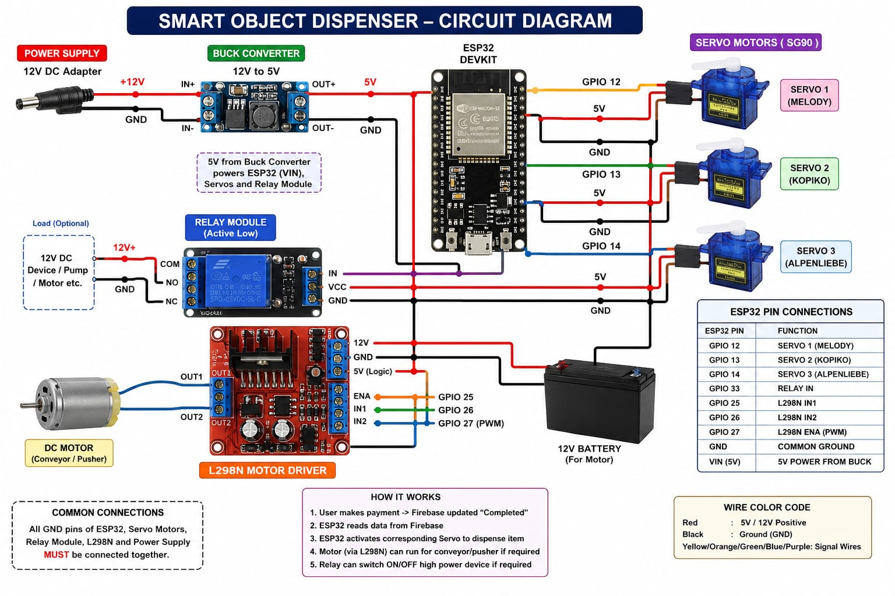
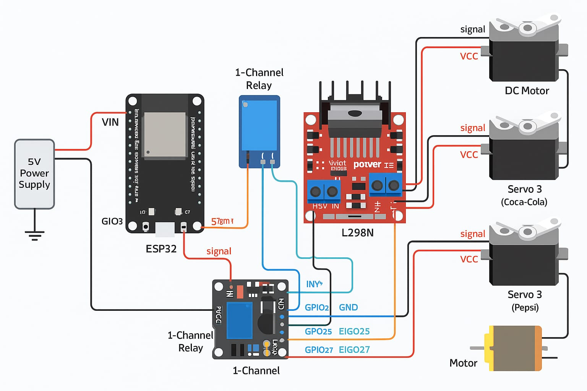
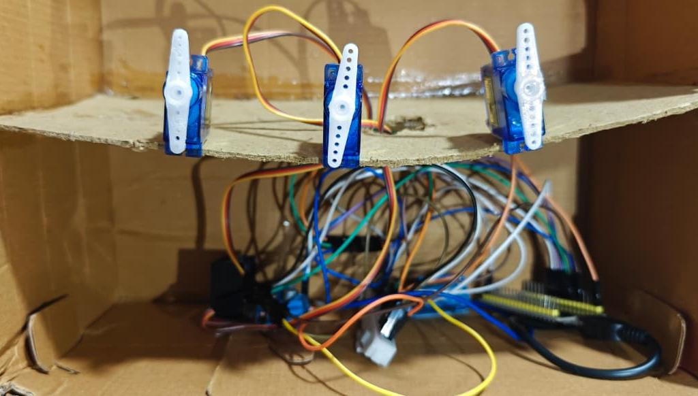
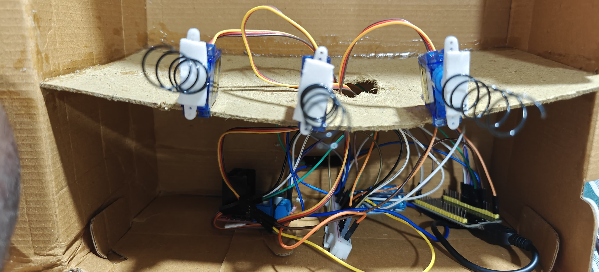
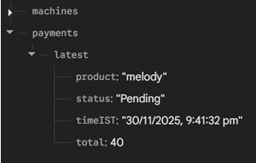
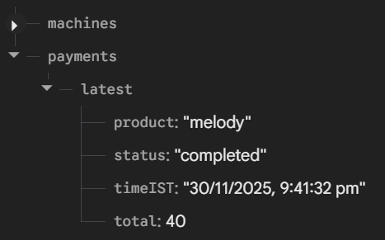
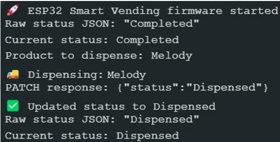

# Smart Object Dispenser using IoT

An IoT-based Smart Object Dispenser developed using the **ESP32 microcontroller**, **Firebase Realtime Database**, **Firebase Hosting**, **Wi-Fi communication**, and a **web-based interface** for automated product dispensing. The system monitors payment status in real time, automatically dispenses the selected product using servo motors, operates a conveyor mechanism through an L298N motor driver, and updates the dispensing status in Firebase.

---

# Table of Contents

- Overview
- Live Demo
- Project Highlights
- Objectives
- System Architecture
- Hardware Components
- Project Workflow
- Web Application
- Firebase Integration
- Features
- Results
- Project Demonstration
- Technologies Used
- Repository Structure
- Applications
- Future Enhancements
- Author
- Acknowledgements
- License

---

# Overview

The Smart Object Dispenser is an IoT-enabled automated dispensing system designed to simplify product distribution through cloud connectivity and embedded automation.

The system consists of an ESP32 microcontroller connected to Firebase Realtime Database over Wi-Fi. A web application hosted on Firebase Hosting allows users to browse products, add them to a cart, generate a UPI payment QR code, and update payment status. Once payment is confirmed, the ESP32 automatically dispenses the selected product using dedicated servo motors, operates the conveyor mechanism, and updates the dispensing status back to Firebase.

This project demonstrates the integration of Embedded Systems, IoT, Cloud Computing, Firebase, and Web Technologies to create a smart and automated dispensing solution.

---

# Live Demo

The Smart Object Dispenser web application is deployed using Firebase Hosting.

**Live Website**

https://smartvending-8f01d.web.app/

The web application allows users to:

- Browse available products
- Add products to the shopping cart
- Generate a UPI payment QR code
- Complete payment
- Synchronize payment information with Firebase Realtime Database
- Automatically trigger product dispensing through the ESP32

---

# Project Highlights

- ESP32-based Smart Object Dispenser
- Firebase Realtime Database Integration
- Firebase Hosting
- Web-Based User Interface
- Wi-Fi Communication
- Automated Product Dispensing
- Servo Motor Control
- Conveyor Motor Control using L298N
- Relay-Controlled Switching
- Real-time Payment Monitoring
- Cloud-Based Product Management
- Automatic Dispensing Status Update

---

# Objectives

- Design an IoT-based smart object dispenser.
- Develop a cloud-connected embedded system.
- Enable online product selection through a website.
- Generate UPI QR codes for payment.
- Monitor payment status in real time.
- Automatically dispense products after successful payment.
- Synchronize dispensing status with Firebase.

---

# System Architecture

## Input

- User
- Web Application
- Firebase Realtime Database

## Processing Unit

- ESP32 Development Board

## Output

- Servo Motors
- Conveyor Motor
- Relay Module
- Firebase Status Update

The web application stores payment information in Firebase. The ESP32 continuously checks the payment status through Wi-Fi. Once the payment is marked as **Completed**, the ESP32 identifies the selected product, activates the corresponding servo motor, operates the conveyor mechanism, and updates the status to **Dispensed** in Firebase.

---

# Hardware Components

| Component | Purpose |
|-----------|----------|
| ESP32 DevKit | Main Controller |
| Servo Motors | Product Dispensing |
| L298N Motor Driver | Conveyor Motor Control |
| Relay Module | Power Switching |
| DC Motor | Conveyor Mechanism |
| Firebase Realtime Database | Cloud Database |
| Firebase Hosting | Web Hosting |
| Wi-Fi | Wireless Communication |
| Power Supply | System Power |

---

# Project Workflow

```text
User
   │
   ▼
Website
   │
   ▼
Firebase Realtime Database
   │
Wi-Fi
   │
   ▼
ESP32
   │
Payment Completed?
   │
No ──────────────┐
                 │
Yes              │
 │
Read Product Name
 │
Activate Relay
 │
Run Conveyor Motor
 │
Rotate Servo Motor
 │
Dispense Product
 │
Update Firebase Status
 │
Repeat Monitoring
```

---

# Web Application

A responsive web interface was developed using HTML, CSS, and JavaScript and deployed on Firebase Hosting.

### Features

- Product browsing
- Add-to-cart functionality
- UPI QR code generation
- Real-time payment status
- Firebase integration
- Automatic synchronization with ESP32
- Responsive user interface

The website serves as the primary interface between the customer and the vending system.

---

# Firebase Integration

Firebase Realtime Database acts as the communication bridge between the website and the ESP32.

Functions performed:

- Product information storage
- Payment status monitoring
- Order information storage
- Product selection
- Dispensing status update
- Real-time synchronization

---

# Features

- Automated Product Dispensing
- ESP32 Embedded Controller
- Firebase Cloud Integration
- Firebase Hosted Website
- Wi-Fi Communication
- UPI QR Code Payment
- Shopping Cart Interface
- Product Selection
- Servo Motor Control
- Conveyor Motor Automation
- Relay Switching
- Cloud Synchronization
- Real-time Status Monitoring

---

# Results

The Smart Object Dispenser prototype was successfully developed and tested.

The system successfully demonstrated:

- Cloud-based product selection
- Firebase Realtime Database communication
- Wi-Fi connectivity with ESP32
- Automatic payment verification
- Product identification
- Servo-based dispensing
- Conveyor motor operation
- Relay-controlled automation
- Automatic database updates
- Reliable embedded-cloud communication

The prototype demonstrated an efficient and low-cost IoT-based dispensing solution suitable for smart vending applications.

---

# Project Demonstration

## Circuit Diagram



---

## Hardware Connection



---

## Hardware Wiring



---

## Prototype



---

## Firebase Database (Pending)



---

## Firebase Database (Completed)



---

## Serial Monitor Output



---

## Working Demonstration

A complete demonstration of the Smart Object Dispenser is available in:

`results/working_demo.mp4`

---

# Technologies Used

## Programming Languages

- Embedded C
- HTML
- CSS
- JavaScript

## Development Environment

- Arduino IDE
- Visual Studio Code

## Embedded Platform

- ESP32

## Cloud Services

- Firebase Realtime Database
- Firebase Hosting

## Communication

- Wi-Fi
- HTTP

## Libraries

- WiFi
- HTTPClient
- ArduinoJson
- ESP32Servo

## Hardware

- ESP32
- Servo Motors
- L298N Motor Driver
- Relay Module
- DC Motor

---

# Repository Structure

```text
Smart-Object-Dispenser-using-IoT/

│
├── results/
│   ├── circuit_diagram.png
│   ├── firebase_completed.png
│   ├── firebase_pending.png
│   ├── hardware_connection.png
│   ├── hardware_wiring.png
│   ├── prototype_front.jpg
│   ├── serial_monitor.png
│   └── working_demo.mp4
│
├── src/
│   └── smart_object_dispenser.ino
│
├── website/
│   ├── index.html
│   ├── style.css
│   └── script.js
│
├── .gitignore
├── LICENSE
├── README.md
└── requirements.txt
```

---

# Applications

- Smart Vending Machines
- Retail Automation
- Smart Stores
- Educational Institutions
- Cafeteria Automation
- Product Dispensing Systems
- IoT Automation
- Embedded System Applications

---

# Future Enhancements

- Mobile Application Integration
- RFID/NFC Authentication
- AI-Based Inventory Prediction
- Cloud Analytics Dashboard
- Inventory Management System
- Multiple Vending Machine Support
- Voice-Controlled Interface
- IoT Dashboard for Remote Monitoring

---

# Author

**Abhishek Alankara**

B.Tech – Electronics and Communication Engineering

SRM University-AP

**LinkedIn:** https://www.linkedin.com/in/abhishekalankara/

**GitHub:** https://github.com/abhishekalankara

---

# Acknowledgements

I would like to express my sincere gratitude to the faculty members and mentors of the Department of Electronics and Communication Engineering, SRM University-AP, for their continuous guidance and support throughout this project. I also acknowledge the open-source community and the developers of Arduino, ESP32, Firebase, and related software libraries for providing the tools that made this project possible.

---

# License

This project is licensed under the **MIT License**.

---

If you found this project useful, consider giving this repository a **Star**.
